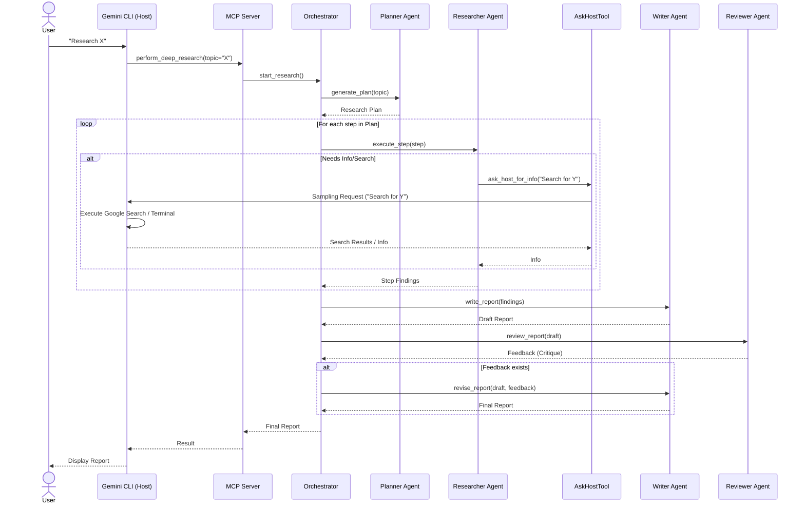
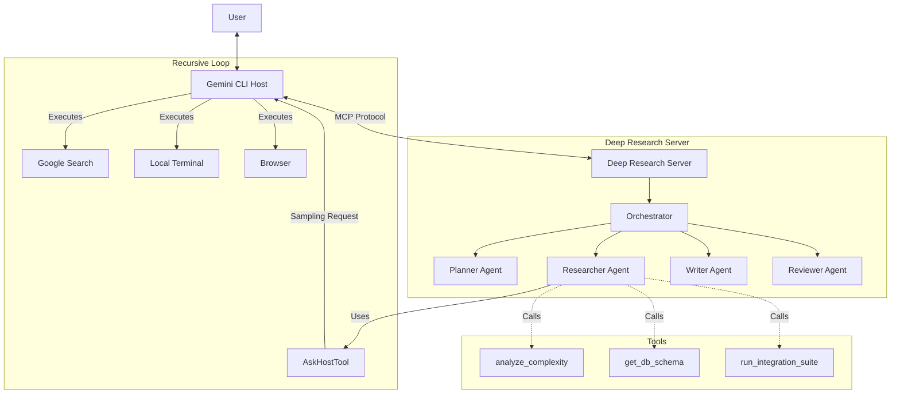

# Deep Research MCP Server for Gemini CLI

This repository hosts a **Model Context Protocol (MCP)** server that provides a "Deep Research" capability to the Gemini CLI. It leverages **Gemini 3.0 Pro** and **Google Search** to perform exhaustive, multi-step research on complex topics.

## 🏗️ Functional Architecture

The system implements a **Level 3 Autonomous Agent** architecture, featuring hierarchical planning, parallel execution, session-scoped memory, and self-correction loops.

### 1. Core Components

| Component | Role | Implementation Details |
| :--- | :--- | :--- |
| **Orchestrator** | **The Controller** | Manages the lifecycle of the research request. It initializes the session, coordinates agent execution, manages the Vector DB, and enforces the feedback loop. |
| **Planner Agent** | **The Strategist** | Decomposes complex user queries into a Directed Acyclic Graph (DAG) of sub-questions. Uses `gemini-3-pro-preview` for reasoning. |
| **Researcher Agent** | **The Worker** | Executed in **PARALLEL** for each sub-question. It uses the `google_search` tool to gather facts and summarizes them into concise notes. |
| **Memory Layer** | **The Context** | A **Session-Scoped Vector Database** (ChromaDB) that stores research notes. It allows the Writer to retrieve semantically relevant information based on the topic. |
| **Writer Agent** | **The Synthesizer** | Aggregates retrieved context and generates a comprehensive report using **Chain of Density** prompting to maximize information value. |
| **Reviewer Agent** | **The Critic** | Analyzes the draft report for accuracy and completeness. If it rejects the draft ("FAIL"), it triggers a revision cycle. |

### 2. Data Flow & Execution Pipeline

The workflow follows a strict **Plan -> Research -> Write -> Review** cycle:

1.  **Initialization**: The `Orchestrator` creates a fresh `Memory` instance (wiped after execution).
2.  **Planning Phase**: The `Planner` breaks the topic into $N$ sub-questions.
3.  **Research Phase (Parallel)**:
    *   The `Orchestrator` spawns $N$ concurrent `Researcher` tasks.
    *   Each researcher gathers data and calls `memory.add()` to store findings.
4.  **Synthesis Phase**:
    *   The `Orchestrator` queries `Memory` for the top $K$ relevant chunks.
    *   The `Writer` generates a `draft_report`.
5.  **Verification Phase (Feedback Loop)**:
    *   The `Reviewer` evaluates the `draft_report`.
    *   **Pass**: The report is returned to the user.
    *   **Fail**: The `Writer` is invoked again with specific feedback to generate a `final_report`.

### 3. End-to-End Execution Flow

This sequence diagram illustrates the complete flow of a Deep Research task, highlighting the recursive "Host Query" mechanism where the Researcher agent asks the Host (Gemini CLI) to perform actions.



### 4. Component Interaction



### 5. Communication Protocol & "Recursive" Logic

The architecture relies on a bidirectional flow enabled by the Model Context Protocol (MCP):

1.  **Host $\rightarrow$ Server (Tool Call):**
    *   **Mechanism:** Standard MCP Tool Execution.
    *   **Purpose:** The Gemini CLI (Host) delegates the complex "Deep Research" task to the MCP Server.
    *   **Flow:** `User` $\rightarrow$ `Gemini CLI` $\rightarrow$ `perform_deep_research()`

2.  **Server $\rightarrow$ Host (Sampling / "Ask Host"):**
    *   **Mechanism:** **MCP Sampling Request** (`ctx.session.send_sampling_request`).
    *   **Purpose:** The Server is isolated and lacks credentials/tools. It "asks" the Host to perform actions on its behalf.
    *   **Flow:** `Researcher Agent` $\rightarrow$ `AskHostTool` $\rightarrow$ **Sampling Request** $\rightarrow$ `Gemini CLI`
    *   **Outcome:** The Gemini CLI receives the request, uses its **native tools** (Google Search, Terminal, Browser) to get the answer, and returns it to the Server.

> **Why this matters:** This allows the "Brain" (Deep Research Agent) to run in a sandboxed server while still leveraging the "Hands" (Tools & Auth) of the user's local environment.

## 🚀 Deployment & Setup

### Prerequisites
*   **Linux** (Tested on Nobara Linux)
*   **Python 3.10 - 3.13** (Pinned to <3.14 to avoid dependency issues)
*   **uv**: An extremely fast Python package installer and resolver.

### 1. Clone and Install
```bash
git clone https://github.com/ic3land3r/Deep-Research-for-CLI.git
cd Deep-Research-for-CLI
uv sync
```

### 2. Configure API Key
Create a `.env` file in the project root:
```bash
echo 'GOOGLE_API_KEY="your_api_key_here"' > .env
```
*Note: The `.env` file is gitignored for security.*

Alternatively, you can set the environment variable manually or edit `run_mcp.sh` (not recommended).

### 3. Connect to Gemini CLI
You need to tell the Gemini CLI where to find this server. Edit your `~/.gemini/settings.json` file.

**Add this block to `mcpServers`:**

```json
"deep-research": {
  "command": "/ABSOLUTE/PATH/TO/Deep-Research-for-CLI/run_mcp.sh",
  "args": [],
  "env": {}
}
```
*Replace `/ABSOLUTE/PATH/TO/...` with the actual full path to the cloned repository.*

### 4. Connect to Google Antigravity
The project includes a `mcp.json` file for auto-discovery.

*   **Auto-Discovery**: Open the project folder in Antigravity, and it should detect the server.
*   **Manual**: If needed, point Antigravity to the `mcp.json` file in the project root.

## 📖 Usage

Once configured, restart your Gemini CLI.

1.  **Verify Installation**:
    Type `/tools` in the CLI. You should see `perform_deep_research` and `analyze_complexity` listed.

2.  **Trigger the Agent**:
    Ask a complex question that requires research.
    > "Perform a deep dive into the current state of Solid State Battery manufacturing challenges in 2025."

3.  **Recursive Analysis**:
    Ask the CLI to analyze a file in the project.
    > "Analyze the complexity of server.py"
    *(The CLI will prompt you to approve the sampling request)*

## 🔧 Troubleshooting

**"Connection closed" Error**:
*   This usually means the server failed to start or printed something to `stdout` that wasn't an MCP message.
*   **Fix**: Ensure you are using `run_mcp.sh`. It handles directory switching correctly.
*   **Debug**: Run the wrapper script manually in your terminal to see if it crashes:
    ```bash
    ./run_mcp.sh
    ```

**"LlmAgent object has no attribute run"**:
*   This error occurs if you try to use the synchronous `.run()` method on an ADK agent.
*   **Fix**: The code has been updated to use `Runner` and `run_async`. Ensure you have the latest version of `agent.py`.
