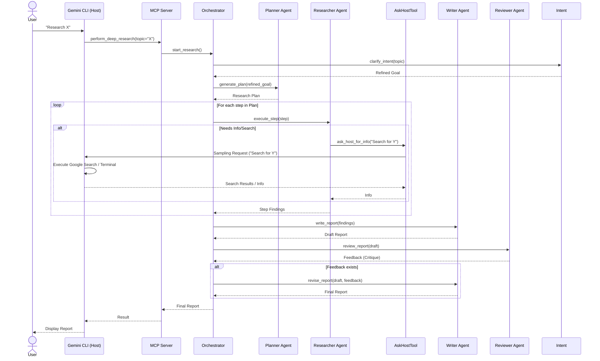
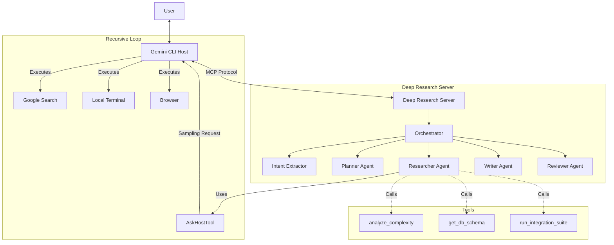
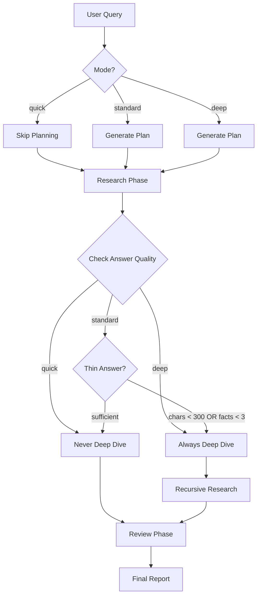
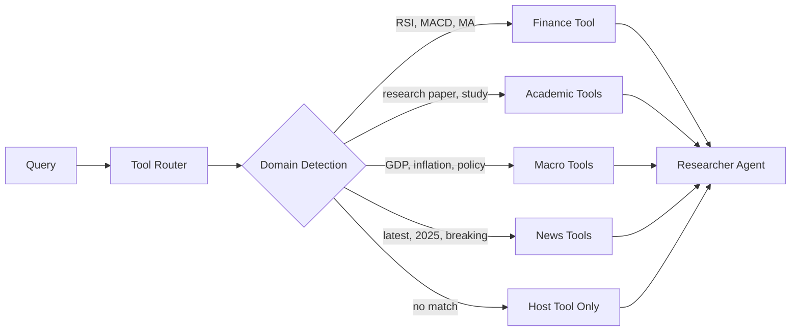
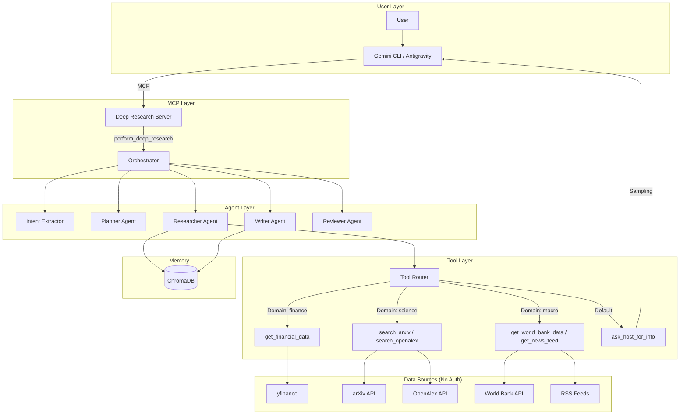

# Deep Research MCP Server for Gemini CLI

This repository hosts a **Model Context Protocol (MCP)** server that provides a "Deep Research" capability to the Gemini CLI. It leverages **Gemini 3.0 Pro** and **Google Search** to perform exhaustive, multi-step research on complex topics.

## 🏗️ Functional Architecture

The system implements a **Level 3 Autonomous Agent** architecture, featuring hierarchical planning, parallel execution, session-scoped memory, and self-correction loops.

### 1. Core Components

| Component | Role | Implementation Details |
| :--- | :--- | :--- |
| **Orchestrator** | **The Controller** | Manages the lifecycle of the research request. It initializes the session, coordinates agent execution, manages the Vector DB, and enforces the feedback loop. |
| **Intent Extractor** | **The Clarifier** | Analyzes vague user queries (e.g., "batteries") and transforms them into specific, context-aware research goals before planning begins. |
| **Planner Agent** | **The Strategist** | Decomposes complex user queries into a Directed Acyclic Graph (DAG) of sub-questions. Uses `gemini-3-pro-preview` for reasoning. |
| **Researcher Agent** | **The Worker** | Executed in **PARALLEL** for each sub-question. Delegates search to the Host via `ask_host_for_info` (since `google_search` is incompatible with Function Calling). |
| **Memory Layer** | **The Context** | A **Session-Scoped Vector Database** (ChromaDB) that stores research notes. It allows the Writer to retrieve semantically relevant information based on the topic. |
| **Writer Agent** | **The Synthesizer** | Aggregates retrieved context and generates a comprehensive report using **Chain of Density** prompting to maximize information value. |
| **Reviewer Agent** | **The Critic** | Analyzes the draft report for accuracy and completeness. If it rejects the draft ("FAIL"), it triggers a revision cycle. |

### 2. Data Flow & Execution Pipeline

The workflow follows a strict **Plan -> Research -> Write -> Review** cycle:

1.  **Initialization**: The `Orchestrator` creates a fresh `Memory` instance.
2.  **Intent Extraction**: The `IntentExtractor` refines the user's raw topic into a clear research goal.
3.  **Planning Phase**: The `Planner` breaks the refined goal into $N$ sub-questions.
4.  **Research Phase (Parallel)**:
    *   The `Orchestrator` spawns $N$ concurrent `Researcher` tasks.
    *   Each researcher gathers data and calls `memory.add()` to store findings.
5.  **Synthesis Phase**:
    *   The `Orchestrator` queries `Memory` for the top $K$ relevant chunks.
    *   The `Writer` generates a `draft_report`.
5.  **Verification Phase (Feedback Loop)**:
    *   The `Reviewer` evaluates the `draft_report`.
    *   **Pass**: The report is returned to the user.
    *   **Fail**: The `Writer` is invoked again with specific feedback to generate a `final_report`.

### 3. End-to-End Execution Flow

This sequence diagram illustrates the complete flow of a Deep Research task, highlighting the recursive "Host Query" mechanism where the Researcher agent asks the Host (Gemini CLI) to perform actions.



### 4. Component Interaction



### 5. Communication Protocol & "Recursive" Logic

The architecture relies on a bidirectional flow enabled by the Model Context Protocol (MCP):

1.  **Host $\rightarrow$ Server (Tool Call):**
    *   **Mechanism:** Standard MCP Tool Execution.
    *   **Purpose:** The Gemini CLI (Host) delegates the complex "Deep Research" task to the MCP Server.
    *   **Flow:** `User` $\rightarrow$ `Gemini CLI` $\rightarrow$ `perform_deep_research()`

2.  **Server $\rightarrow$ Host (Sampling / "Ask Host"):**
    *   **Mechanism:** **MCP Sampling Request** (`ctx.session.send_sampling_request`).
    *   **Purpose:** The Server is isolated and lacks credentials/tools. It "asks" the Host to perform actions on its behalf.
    *   **Flow:** `Researcher Agent` $\rightarrow$ `AskHostTool` $\rightarrow$ **Sampling Request** $\rightarrow$ `Gemini CLI`
    *   **Outcome:** The Gemini CLI receives the request, uses its **native tools** (Google Search, Terminal, Browser) to get the answer, and returns it to the Server.
    *   **User Interaction (Critical):** If the Host needs to run a sensitive command (e.g., `sudo`, file deletion) or requires clarification, it will **prompt the user**. The Deep Research Server **waits asynchronously** for this entire process to complete before resuming.

> **Why this matters:** This allows the "Brain" (Deep Research Agent) to run in a sandboxed server while still leveraging the "Hands" (Tools & Auth) of the user's local environment.

## 🚀 Deployment & Setup

### Prerequisites
*   **Linux** (Tested on Nobara Linux)
*   **Python 3.10 - 3.13** (Pinned to <3.14 to avoid dependency issues)
*   **uv**: An extremely fast Python package installer and resolver.

### 1. Clone and Install
```bash
git clone https://github.com/ic3land3r/Deep-Research-for-CLI.git
cd Deep-Research-for-CLI

# For standalone clones (outside ADK monorepo), comment out the workspace dependency:
# sed -i '/\[tool.uv.sources\]/,/google-adk/d' pyproject.toml

uv sync
```

### 2. Configure API Key
Create a `.env` file in the project root:
```bash
echo 'GOOGLE_API_KEY="your_api_key_here"' > .env
```
*Note: The `.env` file is gitignored for security.*

Alternatively, you can set the environment variable manually or edit `run_mcp.sh` (not recommended).

### 3. Connect to Gemini CLI
You need to tell the Gemini CLI where to find this server. Edit your `~/.gemini/settings.json` file.

**Add this block to `mcpServers`:**

```json
"deep-research": {
  "command": "/ABSOLUTE/PATH/TO/Deep-Research-for-CLI/run_mcp.sh",
  "args": [],
  "env": {}
}
```
*Replace `/ABSOLUTE/PATH/TO/...` with the actual full path to the cloned repository.*

### 4. Connect to Google Antigravity
The project includes a `mcp.json` file for auto-discovery.

*   **Auto-Discovery**: Open the project folder in Antigravity, and it should detect the server.
*   **Manual**: If needed, point Antigravity to the `mcp.json` file in the project root.

## 📖 Usage

Once configured, restart your Gemini CLI.

1.  **Verify Installation**:
    Type `/tools` in the CLI. You should see `perform_deep_research` and `analyze_complexity` listed.

2.  **Trigger the Agent**:
    Ask a complex question that requires research.
    > "Perform a deep dive into the current state of Solid State Battery manufacturing challenges in 2025."

3.  **Recursive Analysis**:
    Ask the CLI to analyze a file in the project.
    > "Analyze the complexity of server.py"
    *(The CLI will prompt you to approve the sampling request)*

## 🔧 Troubleshooting

**"Connection closed" Error**:
*   This usually means the server failed to start or printed something to `stdout` that wasn't an MCP message.
*   **Fix**: Ensure you are using `run_mcp.sh`. It handles directory switching correctly.
*   **Debug**: Run the wrapper script manually in your terminal to see if it crashes:
    ```bash
    ./run_mcp.sh
    ```

**"calling 'initialize': EOF" Error**:
*   This error happens if the server prints non-JSON text (like debug prints) to `stdout` during startup.
*   **Fix**: The `run_mcp.sh` script sets `PYTHONUNBUFFERED=1` and ensures only the JSON-RPC stream uses `stdout`. Always use the script, do not run `server.py` directly.

**"LlmAgent object has no attribute run"**:
*   This error occurs if you try to use the synchronous `.run()` method on an ADK agent.
*   **Fix**: The code has been updated to use `Runner` and `run_async`. Ensure you have the latest version of `agent.py`.

---

## 🎯 Research Modes

The Deep Research agent supports three distinct research modes, each optimized for different use cases:

| Mode | Planning | Deep Dive | Review | Best For |
|:-----|:---------|:----------|:-------|:---------|
| **`quick`** | ❌ Skip | ❌ Never | ✅ Yes | Fast lookups, simple facts |
| **`standard`** | ✅ Yes | 🔄 Conditional | ✅ Yes | Balanced research (default) |
| **`deep`** | ✅ Yes | ✅ Always | ✅ Yes | Exhaustive analysis |

### Usage

```python
# MCP Tool Call
perform_deep_research(topic="Your topic", mode="deep")
```

### Mode Behavior Details



### Deep Dive Trigger (Hybrid Metric)

In `standard` mode, a **deep dive** is triggered when an answer is "thin":
- Character count < 300, **OR**
- Fact count < 3 (bullets, statistics, URLs)

---

## 🔧 Conditional Tool Injection

The agent uses a **Tool Router** to dynamically inject specialized data tools based on query domain.

### Domain Detection Flow



### Available Tools by Domain

| Domain Pattern | Injected Tool(s) | Data Source |
|:---------------|:-----------------|:------------|
| `RSI`, `MACD`, `moving average` | `get_financial_data` | yfinance (no auth) |
| `stock`, `P/E`, `earnings` | `get_financial_data` | yfinance (no auth) |
| `research paper`, `peer review` | `search_arxiv`, `search_openalex` | arXiv, OpenAlex (no auth) |
| `regulation`, `policy`, `federal` | `get_world_bank_data`, `get_news_feed` | World Bank, RSS (no auth) |
| `today`, `latest`, `2025` | `get_world_bank_data`, `get_news_feed` | World Bank, RSS (no auth) |

---

## 📊 Data Source Integrations

All data sources are **permissionless** (no API keys required).

### Finance Tools (`utils/finance_tools.py`)

| Tool | Features | Source |
|:-----|:---------|:-------|
| `get_financial_data` | RSI, MACD, MAs, P/E, analyst targets | yfinance |

**Example Output:**
```
## Technical Indicators
- **RSI (14):** 77.0 (overbought)
- **MACD:** 3.693 (bullish)
- **50-Day MA:** $435.22 (above)
```

### Academic Tools (`utils/academic_tools.py`)

| Tool | Features | Source |
|:-----|:---------|:-------|
| `search_arxiv` | Paper search, abstracts, PDF links | arXiv API |
| `search_openalex` | 240M+ works, citation counts, DOIs | OpenAlex |

### Macro/News Tools (`utils/macro_news_tools.py`)

| Tool | Features | Source |
|:-----|:---------|:-------|
| `get_world_bank_data` | GDP, inflation, unemployment by country | World Bank Open Data |
| `get_news_feed` | Headlines from Reuters, BBC, CNBC, Google News | RSS feeds |

---

## 🏗️ Complete Architecture Diagram



---

## 📝 Changelog

### v0.6.0 (2025-12-12)
**New Features**
- **Intent Extraction**: New `IntentExtractor` agent automatically clarifies vague queries (e.g., "batteries" -> "Current state of battery technology...") before research begins.

### v0.5.0 (2025-12-11)
**New Features**
- **Custom Output Formats**: `output_format` parameter supports `markdown` (default), `json`, or custom schema
- **Current Date Context**: Automatic date injection prevents agents from thinking it's 2024
- **AI Model Version Detection**: Accurate reporting of current AI models (Gemini 3.0, Claude 4.5, GPT-5.x)

**Improvements**
- Updated researcher/reviewer prompts to trust web search results over stale training data
- Added `ai_models` domain pattern in tool router for LLM-related queries

**Removed**
- `analyze_complexity` tool (MCP sampling not supported by clients)
- Placeholder tools (`get_db_schema`, `describe_data_schema`, `run_integration_suite`)

### v0.4.0 (2025-12)
**Phase 1: Robustness**
- Robust plan parsing with JSON primary + regex fallback
- Graceful async failure handling (`return_exceptions=True`)
- Retry logic with exponential backoff (3 attempts, 1s→2s→4s)
- Specific exception handling for network, parsing, and unexpected errors

**Phase 2: Performance**
- Session-scoped memory via `session_id` metadata (no collection recreation)
- Shared ChromaDB client across Memory instances

**Phase 3: Structured Output**
- `ResearchPlan` Pydantic schema for Planner agent (`output_schema`)
- Guaranteed JSON output from Planner, eliminating parsing failures

### v0.3.0 (2024-12)
- **Research Modes**: Added `quick`, `standard`, `deep` modes
- **Finance Tools**: Real-time RSI, MACD, Moving Averages via yfinance
- **Academic Tools**: arXiv and OpenAlex paper search
- **Macro/News Tools**: World Bank data and RSS news feeds
- **Deep Dive Mode**: Hybrid fact density metric for thin answer detection
- **Tool Router**: Conditional tool injection based on query domain

### v0.2.0 (2024-12)
- Source fidelity improvements (URL tracking)
- Reviewer feedback loop
- Host query sampling mechanism

### v0.1.0 (2024-11)
- Initial release with Planner, Researcher, Writer, Reviewer pipeline

