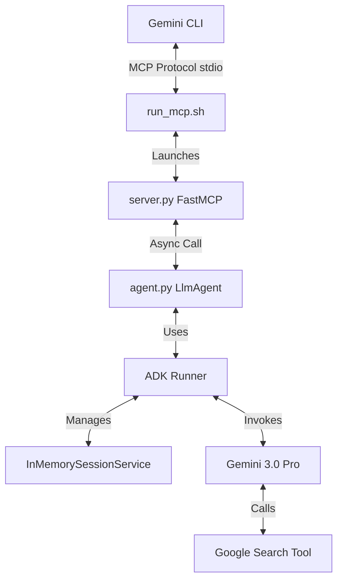
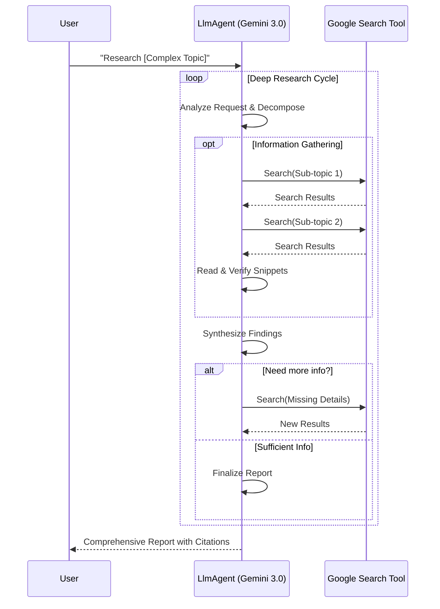

# Deep Research MCP Server for Gemini CLI

This repository hosts a **Model Context Protocol (MCP)** server that provides a "Deep Research" capability to the Gemini CLI. It leverages **Gemini 3.0 Pro** and **Google Search** to perform exhaustive, multi-step research on complex topics.

## 🏗️ Architecture

The system is built using a modular architecture combining the **Google Agent Development Kit (ADK)** and **FastMCP**.



### Key Components

1.  **`server.py` (The Interface)**:
    *   Built with `FastMCP`.
    *   Exposes a single tool: `perform_deep_research`.
    *   Handles the MCP protocol communication with the Gemini CLI over `stdio`.
    *   Asynchronously delegates the actual work to the agent.

2.  **`agent.py` (The Brain)**:
    *   Defines an `LlmAgent` named `deep_researcher`.
    *   **Model**: Uses `gemini-3-pro-preview` for advanced reasoning and synthesis.
    *   **Tools**: Equipped with the `google_search` tool from ADK.
    *   **Execution**: Uses `google.adk.runners.Runner` and `InMemorySessionService` to execute the agent loop asynchronously. This ensures proper state management and event handling required by the ADK.

3.  **`run_mcp.sh` (The Launcher)**:
    *   A robust wrapper script.
    *   Ensures the server runs with the correct Python environment (`uv`) and working directory.
    *   Injects necessary environment variables (API Keys).

## 🔄 Deep Research Workflow

The "Deep Research" capability is achieved through an iterative loop driven by the Gemini 3.0 model's reasoning capabilities and the system prompt.



## 🚀 Deployment & Setup

### Prerequisites
*   **Linux** (Tested on Nobara Linux)
*   **Python 3.10 - 3.13** (Pinned to <3.14 to avoid dependency issues)
*   **uv**: An extremely fast Python package installer and resolver.

### 1. Clone and Install
```bash
git clone https://github.com/ic3land3r/Deep-Research-for-CLI.git
cd Deep-Research-for-CLI
uv sync
```

### 2. Configure API Key
Edit `run_mcp.sh` to set your Google API Key:
```bash
# run_mcp.sh
export GOOGLE_API_KEY="YOUR_ACTUAL_API_KEY"
```
*Alternatively, you can set this in your system environment or `settings.json`, but the wrapper script is the most reliable place for the server process.*

### 3. Connect to Gemini CLI
You need to tell the Gemini CLI where to find this server. Edit your `~/.gemini/settings.json` file.

**Add this block to `mcpServers`:**

```json
"deep-research": {
  "command": "/ABSOLUTE/PATH/TO/Deep-Research-for-CLI/run_mcp.sh",
  "args": [],
  "env": {}
}
```
*Replace `/ABSOLUTE/PATH/TO/...` with the actual full path to the cloned repository.*

## 📖 Usage

Once configured, restart your Gemini CLI.

1.  **Verify Installation**:
    Type `/tools` in the CLI. You should see `perform_deep_research` listed.

2.  **Trigger the Agent**:
    Ask a complex question that requires research.
    > "Perform a deep dive into the current state of Solid State Battery manufacturing challenges in 2025."

    > "Research the latest proton version issues with Black Desert Online."

## 🔧 Troubleshooting

**"Connection closed" Error**:
*   This usually means the server failed to start or printed something to `stdout` that wasn't an MCP message.
*   **Fix**: Ensure you are using `run_mcp.sh`. It handles directory switching correctly.
*   **Debug**: Run the wrapper script manually in your terminal to see if it crashes:
    ```bash
    ./run_mcp.sh
    ```

**"LlmAgent object has no attribute run"**:
*   This error occurs if you try to use the synchronous `.run()` method on an ADK agent.
*   **Fix**: The code has been updated to use `Runner` and `run_async`. Ensure you have the latest version of `agent.py`.
