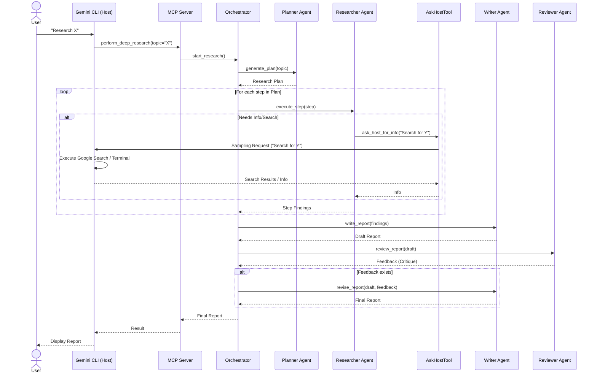
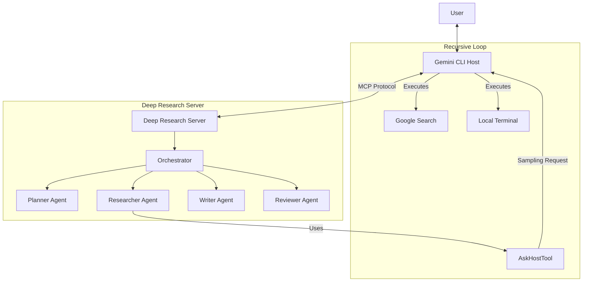

# Deep Research Architecture

## End-to-End Execution Flow

This sequence diagram illustrates the complete flow of a Deep Research task, highlighting the recursive "Host Query" mechanism where the Researcher agent asks the Host (Gemini CLI) to perform actions.

## Component Interaction

